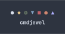

========

[cmdjewel.webm](https://github.com/user-attachments/assets/69ca8994-b557-4e74-9639-5edbd72ed42e)


cmdjewel is a terminal match-3 game inspired by Bejeweled, written with Rust and cursive.

# Running

To run cmdjewel from source, you need to have cargo installed. The recommended way of installing it is through [rustup](https://rustup.rs/).

After cloning cmdjewel, type `cargo run --release` in a terminal. You might need to install some dependencies for cmdjewel's audio library, such as `alsa-lib-devel` on Fedora Linux.

## Something went wrong and I'm not getting any errors printed!
Since cmdjewel writes to the terminal, it clears the screen when it terminates. To see warnings and errors, pipe stderr to a file.  

For example, if you're running cmdjewel with `cargo run --release`, 
```
cargo run --release 2>error.txt
```

# Playing

cmdjewel uses a modal control system. To navigate in SELECT mode, use the arrow keys. Hit space to enter SWAP mode where you can swap a piece with any adjacent
one using the arrow keys. Alternatively you can use Vim keybinds (h, j, k, l) by default.

If you notice everything's too small, try changing your terminal's font size. The game is designed to run at any font size (as long as everything fits!)

# TODO:
- [x] MacOS export
- [x] Music/SFX slider
- [x] Settings page accessible in-game/main menu
- [X] Saving/loading from config files (TOML probably somewhere in ~/.config)
- [X] Better title screen logo
- [x] Animation from moving from the title screen to main menu
- [X] Main menu resembling Bejeweled 3
- [x] Hypercube with hypercube matching
- [ ] Sound effects
- [-] Music rewrite (in progress)
- [ ] Special gems that explode hypercubes activate those hypercubes
- [ ] Star gems
- [ ] Supernova gems
