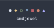

========

[cmdjewel.webm](https://github.com/user-attachments/assets/4173f720-140a-40ca-bd05-ac8a7674ebf0)

cmdjewel is a terminal match-3 game inspired by Bejeweled, written with Rust and cursive.

# Running

To run cmdjewel from source, you need to have cargo installed. The recommended way of installing it is through [rustup](https://rustup.rs/).

After cloning cmdjewel, type `cargo run` in a terminal.

# Playing

cmdjewel uses a modal control system. To navigate in SELECT mode, use the arrow keys. Hit space to enter SWAP mode where you can swap a piece with any adjacent
one using the arrow keys. Alternatively you can use Vim keybinds (h, j, k, l) by default.

If you notice everything's too small, try changing your terminal's font size. The game is designed to run at any font size (as long as everything fits!)

# Credits

This game uses beyond_the_network.it:
- by Skaven252,
- retrieved from [The Mod Archive](https://modarchive.org/index.php?request=view_by_moduleid&query=156184),
- and under a CC-BY-NC-ND 4.0 license.

# TODO (0.2.0):
- [x] Special gems having chain reactions (e.g. a hypercube on a flame gem will explode it rather than remove it)
- [x] Spawn special gems where they were matched (rather than storing more metadata logic should be moved around)
- [x] When looking for gem combinations, make sure they were not created by special gems (e.g. star gems can't make matches of 6) (may have to store metadata?)
- [x] Hypercubes matched with each other just destroy each other. (new struct for a selection of gems)
    - nope they now destroy the whole board because it's easier
- [ ] The number of points it takes to advance levels constantly increases with each level.

# TODO (0.3.0 - can't accept PR's until 0.2.0 is released):
- [ ] Special gems that explode hypercubes activate those hypercubes
- [x] Hypercube with hypercube matching
- [ ] Star gems
- [ ] Supernova gems
